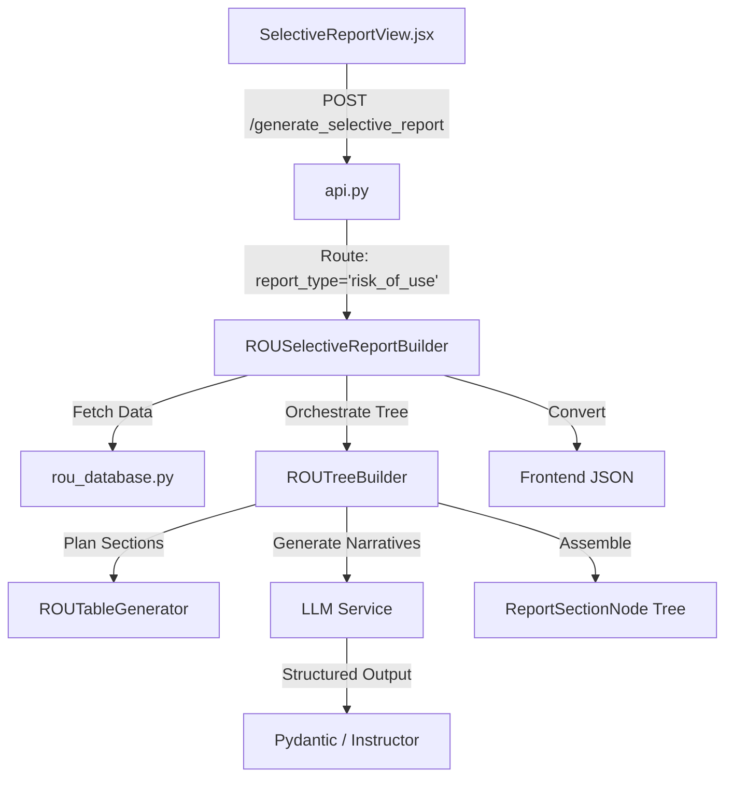
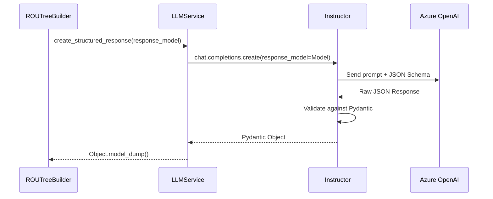

# Risk of Use (RoU) Document Builder: LLM Integration Analysis

This document provides a deep-dive analysis of the LLM orchestration, Pydantic schemas, and Instructor usage within the Risk of Use (RoU) report generation module.

## 1. Architecture Overview

The RoU report generation follows a **Hybrid Builder Pattern**. It combines deterministic Python-based table generation with LLM-powered narrative sections.

## 2. LLM Call Implementation Analysis

### 2.1 Orchestration & Parallelism
The core logic resides in `ROUTreeBuilder.py`. It uses `asyncio` for non-blocking execution and implements a concurrency cap to manage API rate limits.

- **Orchestration & Parallelism:** Uses `asyncio.gather` with a `Semaphore(5)` for both executive narrative and individuated citation analysis.
- **Timeouts:** Enforced via `timeout_with_fallback` (Default: 60 seconds).

### 2.2 Detailed LLM Inventory

The RoU builder implements two primary LLM entry points.

#### A. RoU Executive Summary Narrative
*   **Trigger:** `ROUTreeBuilder._generate_rou_executive_narrative()`
*   **Target Method:** `llm.generate_risk_assessment` (Now restored as a structured wrapper).

#### B. Individual Citation Analysis (Parallel)
*   **Trigger:** `ROUTreeBuilder._build_citation_analysis_section()`
*   **Mechanism:** `asyncio.gather` with `Semaphore(5)`.
*   **Target Method:** `llm.create_structured_response`.

---

## 3. Pydantic & Instructor Integration

The RoU builder leverages Instructor to enforce schema compliance across all narrative sections.

### 3.1 Instructor Workflow
Instructor wraps the OpenAI client and uses Pydantic to enforce schema compliance.

### 3.2 Target Schemas for RoU
The following schemas from `src/llm_contracts.py` are utilized:

1.  **SelectiveExecutiveContentResult:** Used for high-level risk assessment in `generate_risk_assessment`.
    *   Fields: `narrative`, `business_impact`, `registration_prediction`, `regulatory_check`, `recommended_actions`.
2.  **SelectiveTrademarkAnalysisResult:** Used for parallel individuated citation analysis.
    *   Fields: `analysis`, `mitigation_strategy`.

---

## 4. Status: Resolved Namespace Discrepancy

The previously identified discrepancy in `src/llm_service.py` regarding the missing `generate_risk_assessment` method has been RESOLVED.

> [!NOTE]
> **Resolution:** `LLMService.generate_risk_assessment()` has been implemented as a structured wrapper for `create_structured_response`. This ensures compatibility with both standard and RoU tree builders while leveraging the Instructor-based Pydantic validation.

## 5. Summary of LLM Operations

| Task | Scope | Input Data | Output Type | Validation |
| :--- | :--- | :--- | :--- | :--- |
| **Exec Narrative** | Report-wide | Context + Matches | String/JSON | Pydantic (Target) |
| **Citation Analysis** | Per Citation | TM + Goods + Risk | JSON | Instructor |
| **Recommendations** | Final Table | Risk Metrics | List[str] | Heuristic + LLM |
